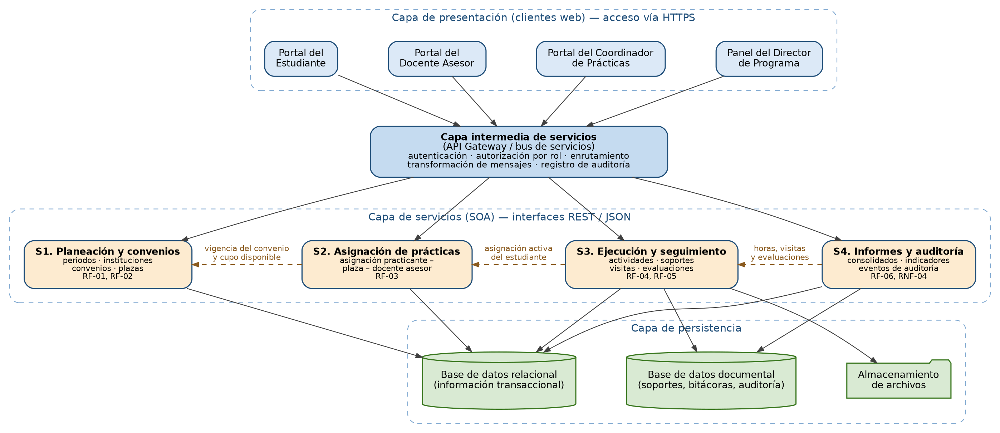
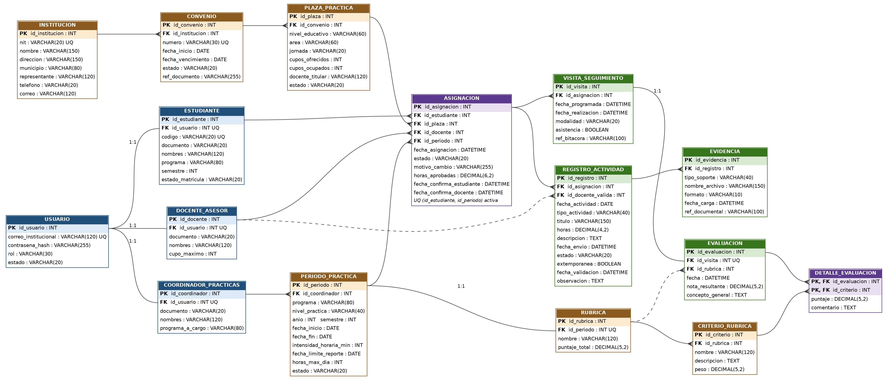

<!-- Archivo generado desde Propuesta_SIGPRA_Primera_Entrega_corregida.docx. -->

UNIVERSIDAD DE INVESTIGACIÓN Y DESARROLLO — UDI

PROGRAMA DE INGENIERÍA DE SISTEMAS

# SIGPRA

Software Integral de Gestión de Prácticas Académicas

Propuesta de Proyecto Integrador — Primera Entrega

Período académico: II – 2026

Semestre: Quinto

Cursos vinculados: Ingeniería del Software II, Programación III, Teoría General de Sistemas

Integrantes:

Jesús Daniel Rueda Castillo

Alonso Andrés Henao Roa

Rafael Fabián Carreño Barrera

Bucaramanga, septiembre de 2026

# Tabla de contenido

# 1. Introducción

La práctica pedagógica es el espacio en el que un estudiante de licenciatura pasa de estudiar la docencia a ejercerla en un aula real, bajo el acompañamiento de un docente asesor de la universidad y de la institución educativa que lo recibe. Es un componente obligatorio del plan de estudios y, al mismo tiempo, un proceso reglado: el Decreto 1075 de 2015 y los lineamientos del Ministerio de Educación Nacional exigen que el programa garantice el cumplimiento de la intensidad horaria, el acompañamiento del practicante y la trazabilidad de todo el proceso, información que después se convierte en evidencia dentro de los procesos de autoevaluación y de acreditación de alta calidad ante el CNA.

Gestionar ese proceso implica coordinar a varias personas que no comparten oficina ni horario: un coordinador de prácticas que programa el periodo y consigue las plazas, unas instituciones educativas que firman convenios y ofrecen cupos, unos estudiantes que ejecutan y reportan sus horas, y unos docentes asesores que visitan las aulas, validan lo reportado y evalúan el desempeño. Cada uno de ellos produce y necesita información del otro en momentos distintos del semestre.

Este documento corresponde a la primera entrega del Proyecto Integrador y presenta la propuesta de SIGPRA (Software Integral de Gestión de Prácticas Académicas), un aplicativo web para gestionar las prácticas pedagógicas de los programas de licenciatura de la UDI. La entrega comprende la descripción del proceso y del problema, los objetivos, la justificación, el plan de trabajo por fases, la propuesta de arquitectura, el levantamiento de requerimientos, el modelado UML y el modelo de datos. Se trata de una propuesta de lo que se va a construir: las decisiones de tecnología concretas se toman en la fase de diseño, una vez terminado el análisis, y no se comprometen desde los objetivos.

# 2. Descripción del problema

## 2.1 Qué es la práctica pedagógica

La práctica pedagógica es una asignatura del plan de estudios de los programas de licenciatura en la que el estudiante debe cumplir un número mínimo de horas de trabajo directo en una institución educativa. No basta con asistir: el estudiante planea clases, las ejecuta con un grupo real, registra lo que hizo, guarda los soportes de su trabajo (planeaciones, diarios de campo, registros de asistencia, material producido) y es observado y evaluado por un docente asesor de la universidad.

La práctica tiene tres condiciones que la hacen distinta de otras asignaturas. La primera es que el estudiante trabaja por fuera de la universidad, en una institución que no pertenece a ella y con la cual debe existir un convenio vigente. La segunda es que las horas cumplidas tienen valor legal: son las que acreditan el cumplimiento de la intensidad horaria reglamentaria y deben poder demostrarse con soportes. La tercera es que la evaluación no la hace únicamente un profesor frente a un examen, sino un docente asesor que observa al practicante en el aula y aplica una rúbrica.

## 2.2 Cómo se desarrolla el proceso actualmente

El proceso se repite cada periodo académico y se puede describir en seis momentos, con actores y solicitudes claramente identificables:

Programación del periodo. El coordinador de prácticas define, para el periodo lectivo y para cada nivel de práctica, cuántas horas debe cumplir el practicante, entre qué fechas, con qué criterios se le evalúa y hasta cuándo puede reportar. Esta información la comunica a estudiantes y docentes asesores por correo y en reuniones de inducción.

Consecución de plazas. El coordinador contacta a las instituciones educativas, gestiona con ellas la firma o renovación del convenio y les pregunta cuántos practicantes pueden recibir, en qué jornada y en qué niveles. Las instituciones responden por correo o por oficio, y esa respuesta queda registrada en un archivo del coordinador.

Asignación. El coordinador revisa qué estudiantes están matriculados y habilitados para hacer la práctica, los cruza contra las plazas disponibles y le asigna a cada uno una institución y un docente asesor. Luego comunica la asignación al estudiante, al docente asesor y a la institución receptora.

Ejecución y reporte. El estudiante asiste a la institución, desarrolla las actividades acordadas y reporta lo realizado: fecha, actividad, horas invertidas, descripción de lo trabajado y los soportes correspondientes. Ese reporte lo entrega al docente asesor en el formato que cada uno maneje (formatos físicos firmados, archivos por correo o por la plataforma del aula virtual).

Seguimiento y evaluación. El docente asesor programa visitas a la institución, observa al practicante en el aula, deja constancia de lo observado, revisa y valida las horas que el estudiante reportó y aplica la rúbrica de evaluación. Si el estudiante no asiste o si un soporte no cumple, lo devuelve para corrección e informa al coordinador.

Consolidación e informes. Al cierre del periodo, el coordinador debe responder preguntas como cuántos estudiantes cumplieron las horas exigidas, cuántas plazas se usaron, qué convenios siguen vigentes y qué evidencias respaldan cada caso. Con esa información el director del programa responde ante la decanatura y ante los pares académicos en los procesos de autoevaluación y acreditación.

Toda esta coordinación se apoya hoy en herramientas de propósito general: hojas de cálculo para el listado de estudiantes y plazas, correo electrónico para las confirmaciones, formatos impresos o digitales para los reportes de horas y carpetas personales para los soportes. Es decir, el proceso funciona y produce el resultado esperado, pero cada actor conserva su propia copia de la información y la única forma de saber el estado real de una práctica es preguntarle a la persona que la tiene.

## 2.3 Dificultades que se observan en la operación actual

Descrito el proceso, se pueden señalar los puntos donde la forma actual de trabajar empieza a ser difícil de sostener a medida que crecen el número de estudiantes y de convenios:

La información de un mismo estudiante queda repartida entre el archivo del coordinador, el correo del docente asesor y los soportes del propio estudiante, de modo que consolidar el estado de una práctica exige cruzar varias fuentes.

No hay un punto único donde se sepa, en el momento de asignar, qué convenios están vigentes y cuántos cupos quedan libres, lo que retrasa la asignación y obliga a confirmarla de nuevo con la institución.

Las horas reportadas y su validación quedan en documentos separados, por lo que reconstruir quién aprobó qué horas y en qué fecha depende de la memoria y de los archivos de cada docente.

Los soportes que sustentan el cumplimiento de la práctica se guardan en equipos personales, con el riesgo de que se pierdan justo cuando se necesitan como evidencia, a veces varios años después.

Los informes de cierre se construyen desde cero cada periodo, de forma manual, lo que consume tiempo del coordinador en verificación operativa.

## 2.4 Problema central

A partir de lo anterior, el problema se formula así: ¿cómo diseñar y construir un aplicativo web que soporte el proceso completo de las prácticas pedagógicas de los programas de licenciatura de la UDI —programación del periodo, gestión de convenios y plazas, asignación de practicantes, reporte y validación de la práctica ejecutada, seguimiento y evaluación en sitio, y consolidación del estado del proceso—, de manera que todos los actores trabajen sobre la misma información, cada acción crítica quede registrada de forma verificable y los soportes de cada práctica se conserven y puedan recuperarse cuando el programa deba demostrarlos?

## 2.5 Alcance del proyecto

El levantamiento de requerimientos y el modelado de casos de uso de esta entrega cubren el proceso completo descrito en el numeral 2.2, incluso aquellas partes que no se van a implementar. Modelar todo el proceso permite entender cómo funciona y dónde encaja cada pieza; el alcance de construcción, en cambio, se limita deliberadamente para que sea alcanzable dentro del periodo académico.

En consecuencia, el equipo desarrollará los requerimientos RF-01 a RF-05. El requerimiento RF-06, correspondiente a la consolidación de indicadores para los informes de acreditación, queda modelado y documentado pero no se implementará en este proyecto, más allá de una consulta básica del avance de horas por estudiante y por periodo. Tampoco se aborda la integración automática con el sistema de información académica de la universidad: para efectos del proyecto, la información de matrícula y de habilitación del estudiante se cargará en el sistema, y la integración queda planteada como trabajo futuro.

# 3. Objetivos

## 3.1 Objetivo general

Desarrollar un aplicativo web para la gestión de las prácticas pedagógicas de los programas de licenciatura de la Universidad de Investigación y Desarrollo, que soporte la programación del periodo, la asignación de los practicantes a las instituciones receptoras, el registro y la validación de la práctica ejecutada, y el seguimiento y la evaluación por parte del docente asesor.

## 3.2 Objetivos específicos

Caracterizar el proceso de las prácticas pedagógicas de los programas de licenciatura de la UDI e identificar los actores, las reglas y los requerimientos funcionales y no funcionales que debe cumplir el aplicativo.

Diseñar la arquitectura, el modelo de datos y las interfaces de usuario del aplicativo, evaluando y seleccionando las tecnologías de desarrollo y de persistencia más adecuadas a los requerimientos levantados.

Construir el aplicativo web de acuerdo con el diseño definido, cubriendo los requerimientos priorizados en el alcance del proyecto.

Verificar el funcionamiento del aplicativo mediante pruebas sobre los requerimientos construidos y elaborar la documentación técnica y de usuario del sistema.

Los cuatro objetivos se plantean desde el inicio del proyecto y se desarrollan de manera progresiva a lo largo del semestre: cada entrega del Proyecto Integrador muestra el avance alcanzado en ellos, y no la finalización de unos objetivos y el inicio de otros.

# 4. Justificación

El coordinador de prácticas de un programa de licenciatura no solo debe garantizar que cada estudiante cumpla las horas reglamentarias; también responde por la trazabilidad del proceso ante la dirección del programa, ante la decanatura y ante los pares académicos que visitan la universidad en los procesos de acreditación. Cuando esa información vive repartida entre hojas de cálculo, correos y carpetas personales, la respuesta a una solicitud de evidencia depende de que la persona que la guardó siga disponible y conserve el archivo.

Centralizar el proceso en un aplicativo web permite que el coordinador, los docentes asesores y los estudiantes trabajen sobre la misma información, que cada acción crítica quede registrada con su autor y su fecha, y que los soportes de la práctica se conserven en un repositorio institucional y no en equipos personales. Esto no implica que las herramientas actuales estén mal utilizadas: implica que, a medida que crecen el número de practicantes y de convenios, coordinarlas entre varias personas se vuelve costoso en tiempo y frágil frente a auditorías.

Para la universidad, el beneficio es doble: reduce el trabajo operativo de verificación manual y mejora su capacidad de respuesta frente a requerimientos normativos, porque la información de cumplimiento y sus soportes quedan disponibles en el momento en que se piden. Para el practicante, el beneficio es la certeza de saber en cualquier momento cuántas horas lleva aprobadas y qué le falta, sin tener que pedirle esa información a otra persona.

Finalmente, el proyecto integra de forma natural lo trabajado en los tres cursos vinculados: el análisis, el modelado y la gestión del proceso de desarrollo propios de Ingeniería del Software II; la construcción de los servicios y la persistencia de datos de Programación III; y la identificación de actores, entradas, salidas y límites del sistema de Teoría General de Sistemas, sin dejar de lado los criterios de diseño e interacción trabajados en Diseño Web y Usabilidad.

# 5. Propuesta del plan del proyecto

## 5.1 Metodología de desarrollo

El proyecto se desarrollará siguiendo un modelo de ciclo de vida en cascada. La elección se sustenta en dos condiciones del proyecto: el alcance está delimitado por el calendario académico y no se espera que cambie de forma sustancial durante el semestre, y cada entrega del Proyecto Integrador corresponde de manera natural al cierre de una fase, con productos verificables. Las fases se ejecutan de forma secuencial y cada una toma como entrada el producto aprobado de la anterior; se admite realimentación hacia la fase inmediatamente anterior cuando una verificación detecta una omisión.

La siguiente tabla describe qué se hace y qué se entrega en cada fase. Nótese que en esta primera entrega el equipo se encuentra cerrando la fase de análisis: aún no se define qué módulos tendrá el aplicativo, porque esa definición es un resultado de la fase de diseño y no una decisión previa al estudio del problema.

| Fase | Actividades principales | Entregables de la fase |
| --- | --- | --- |
| F1. Análisis de requerimientos | Caracterización del proceso de práctica; identificación de actores; entrevistas y revisión normativa; levantamiento de requerimientos funcionales y no funcionales; definición de reglas de negocio y del alcance; modelado de casos de uso y del dominio. | Documento de propuesta; catálogo de requerimientos; diagrama de casos de uso con sus fichas; diagrama de dominio; definición del alcance. |
| F2. Diseño | Definición del estilo arquitectónico y de los servicios; evaluación y selección de tecnologías de desarrollo y de persistencia; diseño del modelo entidad-relación y del modelo relacional; definición de las estructuras de información de formato variable; diseño de las interfaces de usuario. | Diagrama arquitectónico; modelo entidad-relación y modelo relacional; diccionario de datos; especificación de las interfaces de los servicios; prototipos de interfaz. |
| F3. Construcción | Implementación de los servicios definidos y de los clientes web por rol; implementación de las reglas de negocio y del registro de auditoría; integración entre servicios; control de versiones sobre el repositorio del proyecto. | Código fuente documentado en el repositorio; servicios desplegables; aplicativo funcional sobre los requerimientos del alcance. |
| F4. Pruebas y verificación | Pruebas funcionales por requerimiento; pruebas de las reglas de negocio; pruebas de los requerimientos no funcionales medibles; corrección de defectos encontrados. | Plan y casos de prueba; registro de ejecución de pruebas y de defectos corregidos. |
| F5. Documentación y cierre | Elaboración de la documentación técnica y del manual de usuario; preparación del material de sustentación. | Documentación técnica y de usuario; artículo en formato IEEE; póster y video de demostración. |

## 5.2 Cronograma

El cronograma alinea las fases anteriores con las fechas de entrega establecidas para el Proyecto Integrador:

| Periodo | Fase | Hito del Proyecto Integrador |
| --- | --- | --- |
| Agosto – 30 de agosto de 2026 | F1. Análisis de requerimientos | Primer avance: propuesta, requerimientos, casos de uso, dominio y primer modelado de datos. |
| Septiembre – 11 de octubre de 2026 | F2. Diseño e inicio de F3. Construcción | Segundo avance: arquitectura definida, modelo relacional, prototipo de alta fidelidad y funcionalidad sobre al menos la mitad de los requerimientos del alcance. |
| Octubre – 15 de noviembre de 2026 | F3. Construcción y F4. Pruebas | Entrega final: aplicativo funcional sobre el alcance definido, pruebas ejecutadas y registro de auditoría operativo. |
| Noviembre de 2026 | F5. Documentación y cierre | Sustentación: documentación técnica y de usuario, artículo IEEE, póster y video de demostración. |

# 6. Arquitectura propuesta

## 6.1 Estilo arquitectónico

El aplicativo se propone como una solución orientada a servicios (SOA) y no como una aplicación monolítica. La razón es funcional antes que técnica: el proceso de práctica agrupa responsabilidades con ciclos de vida distintos. La programación del periodo y los convenios cambian una o dos veces por semestre; el reporte de actividades y la carga de soportes ocurren a diario y concentran la mayor parte de la carga y del volumen de almacenamiento; la consulta consolidada es esporádica pero pesada. Separar estas responsabilidades en servicios permite evolucionarlas y desplegarlas de forma independiente.

Cada servicio expone su funcionalidad a través de una interfaz REST que intercambia mensajes en formato JSON. Conviene precisar la relación entre ambos conceptos: SOA es el estilo con el que se organiza el sistema en servicios con responsabilidades propias, mientras que REST es el mecanismo mediante el cual esos servicios se comunican con los clientes y entre sí. No son alternativas en competencia, sino dos niveles distintos de la misma decisión de diseño.

Los clientes web nunca acceden directamente a las bases de datos ni a los servicios: toda solicitud pasa por una capa intermedia que resuelve la autenticación, la autorización según el rol del usuario, el enrutamiento hacia el servicio correspondiente y el registro de los eventos de auditoría.

## 6.2 Servicios propuestos

Se proponen cuatro servicios, delimitados por la cohesión de la información que administran y por la frecuencia con la que esa información cambia:

| Servicio | Responsabilidad | Información que administra | Requerimientos que soporta |
| --- | --- | --- | --- |
| S1. Planeación y convenios | Configuración del periodo de práctica y administración de instituciones receptoras, convenios y plazas disponibles. | Periodos, reglas del periodo, instituciones, convenios, plazas y cupos. | RF-01, RF-02 |
| S2. Asignación de prácticas | Vinculación del practicante con una plaza y con un docente asesor, y verificación de las condiciones que la habilitan. | Asignaciones, estado de la asignación y su histórico. | RF-03 |
| S3. Ejecución y seguimiento | Registro de la práctica ejecutada por el estudiante, custodia de los soportes, validación de horas, visitas de acompañamiento y evaluación. | Registros de actividad, soportes documentales, visitas, rúbricas y evaluaciones. | RF-04, RF-05 |
| S4. Informes y auditoría | Consolidación del estado de las prácticas y conservación del registro de eventos de auditoría del sistema. | Consultas consolidadas, indicadores y eventos de auditoría. | RF-06 (modelado), RNF-04 |

La comunicación entre servicios se mantiene deliberadamente reducida: S2 consulta a S1 la vigencia del convenio y la disponibilidad de cupo antes de confirmar una asignación, S3 consulta a S2 la asignación activa del estudiante antes de aceptar un registro de actividad, y S4 consume la información de ejecución para construir los consolidados. Ningún servicio escribe directamente sobre la información que otro administra.

## 6.3 Vista en capas y diagrama arquitectónico

El siguiente diagrama muestra la distribución de los clientes, la capa intermedia, los cuatro servicios y la capa de persistencia:

Figura 1. Diagrama arquitectónico de SIGPRA (vista de servicios y capas).

La capa de persistencia contempla dos formas de almacenamiento con propósitos distintos. La información transaccional que exige integridad referencial —estudiantes, instituciones, convenios, plazas, asignaciones, periodos, registros de horas y evaluaciones— se administra en una base de datos relacional. La información cuyo contenido varía de un caso a otro —los soportes documentales cargados por el practicante, las bitácoras de las visitas y los eventos de auditoría— se administra en una base de datos documental, y los archivos propiamente dichos se conservan en un almacenamiento de archivos referenciado desde el modelo. La selección de los motores concretos corresponde a la fase de diseño; en esta propuesta se documenta la necesidad, no el producto.

## 6.4 Supuestos de diseño en materia de seguridad

Las siguientes condiciones se asumen como obligaciones propias de cualquier sistema que administre información académica y personal, y por lo tanto no se enuncian como requerimientos no funcionales sino como supuestos de diseño que el equipo debe cumplir:

Autenticación con credenciales institucionales y resolución del rol desde el servidor, nunca por selección del usuario al iniciar sesión.

Verificación del rol en cada operación expuesta por los servicios.

Almacenamiento de contraseñas mediante funciones de hash y nunca en texto plano.

Validación de los datos de entrada tanto en el cliente como en el servidor.

Respuestas de error sin exposición de trazas internas del sistema.

# 7. Análisis de requerimientos

## 7.1 Actores del sistema

Se identificaron seis actores: cuatro que interactúan directamente con el aplicativo y dos externos, que participan en el proceso sin operar el sistema o que intercambian información con él.

| Actor | Tipo | Participación en el proceso |
| --- | --- | --- |
| Coordinador de prácticas | Principal | Programa el periodo de práctica y sus reglas, gestiona las instituciones receptoras, los convenios y las plazas, asigna a cada practicante una plaza y un docente asesor, atiende las novedades reportadas y consulta el estado consolidado del proceso. |
| Estudiante practicante | Principal | Consulta su asignación y las condiciones de su práctica, registra las actividades ejecutadas con sus horas, carga los soportes que las respaldan, atiende las devoluciones del docente asesor y consulta su avance. |
| Docente asesor | Principal | Acompaña a los practicantes asignados, valida o devuelve las actividades y los soportes reportados, programa y registra las visitas de acompañamiento, aplica la rúbrica de evaluación y reporta las novedades al coordinador. |
| Director de programa | Principal | Consulta el estado consolidado de las prácticas del programa y los soportes asociados, para efectos de seguimiento académico y de los procesos de autoevaluación y acreditación. |
| Institución receptora | Externo | Suscribe el convenio, informa los cupos y las condiciones de la plaza, recibe al practicante y recibe la notificación de las asignaciones. No opera el sistema en el alcance de este proyecto; su información la registra el coordinador. |
| Sistema de información académica | Externo | Fuente de la información de matrícula y de habilitación del estudiante para cursar la práctica. En el alcance de este proyecto esa información se carga en el sistema; la integración automática queda como trabajo futuro. |

## 7.2 Requerimientos funcionales

Los requerimientos se formulan sobre el objeto por el cual se construye el software —la gestión de la práctica pedagógica— y no sobre operaciones de mantenimiento de datos. El registro y la actualización de estudiantes, docentes o instituciones se dan por supuestos: son condiciones necesarias para que exista una práctica que gestionar, no el propósito del sistema. Cada requerimiento involucra a más de un actor y describe el flujo de información completo, incluida la información concreta que se registra y las notificaciones que produce.

| RF-01 | Programación del periodo de práctica |
| --- | --- |
| Actores | Coordinador de prácticas (ejecuta); estudiante practicante y docente asesor (consultan). |
| Descripción | El coordinador de prácticas debe poder abrir un periodo de práctica para un programa de licenciatura y un nivel de práctica determinados, dejando definidas las condiciones bajo las cuales se va a ejecutar ese periodo. Al crear el periodo el sistema presenta los periodos de años anteriores del mismo programa, de modo que el coordinador pueda partir de la última configuración utilizada en lugar de capturarla de nuevo. Una vez publicado el periodo, sus reglas quedan visibles para los estudiantes y los docentes asesores vinculados, y toda práctica que se asigne en adelante queda sujeta a ellas. El periodo solo puede cerrarse cuando no existan registros de actividad pendientes de validación; al cerrarlo, el sistema deja el periodo en estado histórico y consultable, pero no admite nuevos registros. |
| Información que se registra | Programa de licenciatura y nivel de práctica; año y semestre; fechas de inicio y de finalización del periodo; intensidad horaria mínima exigida; fecha límite para el reporte de actividades; criterios de evaluación y sus pesos (rúbrica aplicable al periodo); estado del periodo (en configuración, publicado, cerrado); coordinador responsable. |
| Validaciones | La intensidad horaria configurada no puede ser inferior al mínimo reglamentario definido para ese nivel de práctica; la fecha límite de reporte no puede ser posterior a la fecha de cierre del periodo; los pesos de los criterios de evaluación deben sumar el total definido para la rúbrica. |
| Notificaciones | Al publicarse el periodo, los docentes asesores y los estudiantes habilitados reciben la notificación con las fechas, la intensidad horaria exigida y los criterios de evaluación. |
| Prioridad / alcance | Alta. Se desarrolla en este proyecto. |

| RF-02 | Gestión de convenios y plazas de práctica |
| --- | --- |
| Actores | Coordinador de prácticas (ejecuta); institución receptora (actor externo que suscribe el convenio e informa los cupos). |
| Descripción | El coordinador debe poder administrar las instituciones educativas con las que el programa mantiene convenio y, dentro de cada convenio, las plazas de práctica que la institución ofrece para el periodo. El sistema mantiene la disponibilidad de cada plaza: al confirmarse una asignación descuenta un cupo y al anularse lo devuelve, de modo que la disponibilidad que ve el coordinador en el momento de asignar corresponde al estado real y no a una consulta previa. Un convenio cuya fecha de vigencia expira pasa a estado inactivo y sus plazas dejan de ofrecerse, sin afectar a las prácticas ya asignadas y en ejecución bajo ese convenio. El coordinador debe poder consultar, en cualquier momento del periodo, qué convenios vencen dentro de los siguientes sesenta días, para gestionar su renovación antes del periodo siguiente. |
| Información que se registra | De la institución: NIT, nombre, dirección, municipio, nombre del rector o representante, teléfono y correo de contacto. Del convenio: número, fechas de inicio y de vencimiento, estado y documento digitalizado del convenio. De cada plaza: nivel educativo y área, jornada, número de cupos ofrecidos, cupos ocupados, nombre del docente titular que acompaña al practicante en la institución y estado de la plaza. |
| Validaciones | No se pueden crear plazas sobre un convenio inactivo o vencido; el número de cupos ocupados nunca puede superar el número de cupos ofrecidos; la fecha de vencimiento del convenio debe ser posterior a la de inicio. |
| Notificaciones | El sistema avisa al coordinador cuando un convenio entra en los sesenta días previos a su vencimiento y cuando un convenio pasa a estado inactivo. |
| Prioridad / alcance | Alta. Se desarrolla en este proyecto. |

| RF-03 | Asignación del practicante a una plaza y a un docente asesor |
| --- | --- |
| Actores | Coordinador de prácticas (ejecuta); estudiante practicante y docente asesor (reciben y confirman); institución receptora (recibe la notificación). |
| Descripción | Este es el requerimiento central del sistema. El coordinador debe disponer de la lista de estudiantes habilitados para el periodo abierto, ordenada de manera que aparezcan primero los que aún no tienen asignación. Al seleccionar un estudiante, el sistema muestra las plazas con cupo disponible bajo convenio vigente, indicando para cada una la institución, el municipio, el nivel educativo, la jornada, los cupos libres y el nombre del docente titular; y muestra los docentes asesores disponibles con el número de practicantes que cada uno tiene asignado en el periodo. El coordinador selecciona la plaza y el docente asesor y confirma la vinculación. Al confirmarla, el sistema descuenta el cupo de la plaza, deja la asignación en estado activa con su fecha, y notifica al estudiante, al docente asesor y al contacto de la institución receptora, indicando la institución, la jornada, el docente titular, el docente asesor asignado, las fechas del periodo y la intensidad horaria que debe cumplirse. El estudiante y el docente asesor confirman la recepción desde el sistema. Una asignación puede reasignarse cuando la institución o el estudiante lo solicitan: en ese caso el sistema libera el cupo anterior, descuenta el nuevo, conserva el historial de las horas ya aprobadas y notifica a todos los involucrados el cambio y su motivo. |
| Información que se registra | Estudiante, plaza, convenio, docente asesor y periodo; fecha y hora de la asignación y usuario que la realiza; estado de la asignación (activa, reasignada, anulada, finalizada); motivo en los cambios de estado; fecha de confirmación de recepción por parte del estudiante y del docente asesor. |
| Validaciones | No se puede asignar a un estudiante que no esté habilitado para el periodo; no se puede asignar a una plaza sin cupo disponible ni bajo convenio inactivo o vencido; un estudiante no puede tener más de una asignación activa en el mismo periodo; no se puede asignar un docente asesor que haya alcanzado su cupo máximo de practicantes. |
| Notificaciones | Notificación de asignación, de reasignación y de anulación al estudiante, al docente asesor y a la institución receptora. |
| Prioridad / alcance | Alta. Se desarrolla en este proyecto. |

| RF-04 | Registro y validación de la práctica ejecutada |
| --- | --- |
| Actores | Estudiante practicante (registra); docente asesor (valida o devuelve); coordinador de prácticas (recibe las novedades). |
| Descripción | El estudiante con asignación activa debe poder registrar cada jornada de práctica ejecutada y adjuntarle los soportes que la respaldan. El sistema distingue varios tipos de soporte —planeación de clase, diario de campo, registro de asistencia firmado por la institución y material producido con los estudiantes—, exige los que el periodo haya definido como obligatorios para el tipo de actividad y admite los demás como complementarios. Registrada la actividad, el estudiante la envía a validación y esta queda visible para el docente asesor con sus soportes. El docente asesor revisa el registro y puede aprobarlo, con lo cual las horas se suman al acumulado del estudiante, o devolverlo con una observación que indique qué debe corregirse; en este último caso el registro vuelve al estudiante en estado devuelto, conservando lo ya cargado, para que lo corrija y lo envíe de nuevo. Las actividades enviadas después de la fecha límite del periodo quedan marcadas como extemporáneas y aparecen en la bandeja de novedades del coordinador. El estudiante debe poder consultar en todo momento sus horas aprobadas, las que están en revisión y las que faltan frente a la intensidad exigida. |
| Información que se registra | De la actividad: asignación a la que pertenece, fecha de la actividad, tipo de actividad, título, número de horas, descripción de lo realizado y de los resultados obtenidos, fecha de envío y estado (borrador, enviada, aprobada, devuelta). De cada soporte: tipo, nombre y formato del archivo, fecha de carga y registro al que pertenece. De la validación: docente asesor que la realiza, fecha, decisión y observación. |
| Validaciones | Solo se admiten registros de un estudiante con asignación activa y dentro de las fechas del periodo; las horas registradas en una jornada no pueden exceder el máximo diario definido para el periodo; no se puede enviar a validación una actividad sin los soportes obligatorios; las horas de un registro devuelto no se contabilizan en el acumulado. |
| Notificaciones | El docente asesor recibe aviso de las actividades pendientes de validación; el estudiante recibe aviso de la aprobación o devolución con la observación; el coordinador recibe aviso de los envíos extemporáneos. |
| Prioridad / alcance | Alta. Se desarrolla en este proyecto. |

| RF-05 | Seguimiento y evaluación del practicante |
| --- | --- |
| Actores | Docente asesor (ejecuta); estudiante practicante (es evaluado y consulta el resultado); coordinador de prácticas (recibe las novedades). |
| Descripción | El docente asesor debe poder programar las visitas de acompañamiento a los practicantes que tiene asignados y registrar lo observado en cada una. Al programar la visita, el sistema informa al estudiante y a la institución la fecha y la hora previstas. Durante la visita el docente registra la bitácora de la observación —lo observado en el aula, las recomendaciones hechas al practicante y los compromisos acordados— y, cuando corresponde según el momento del periodo, aplica la rúbrica definida para el periodo, calificando cada criterio y dejando el comentario que sustenta la calificación. El sistema calcula la nota resultante a partir de los pesos configurados en el periodo y la deja disponible para el estudiante junto con la retroalimentación. Si el practicante no se presenta a la visita, el docente registra la inasistencia con su justificación o sin ella y el sistema notifica al coordinador de prácticas, que es quien decide la actuación correspondiente. El estudiante debe poder consultar el historial de las visitas realizadas, las observaciones recibidas y sus calificaciones por criterio. |
| Información que se registra | De la visita: asignación, fecha y hora programadas, fecha y hora de realización, modalidad (presencial o virtual), asistencia del estudiante y bitácora de la observación. De la evaluación: rúbrica aplicada, calificación y comentario por criterio, nota resultante, concepto general y fecha; docente asesor que la registra. |
| Validaciones | Solo pueden registrarse visitas y evaluaciones sobre asignaciones activas del propio docente asesor; no se puede aplicar una rúbrica distinta de la definida para el periodo de la asignación; una evaluación registrada no puede modificarse sin dejar constancia del cambio y de su autor. |
| Notificaciones | El estudiante y la institución reciben aviso de la visita programada; el estudiante recibe aviso del resultado de la evaluación; el coordinador recibe aviso de las inasistencias registradas. |
| Prioridad / alcance | Alta. Se desarrolla en este proyecto. |

| RF-06 | Consolidación del estado de las prácticas e informes de cumplimiento |
| --- | --- |
| Actores | Coordinador de prácticas y director de programa (consultan). |
| Descripción | El coordinador y el director del programa deben poder consultar el estado consolidado de las prácticas de un periodo: cuántos practicantes están asignados y en qué instituciones, el porcentaje de avance de horas de cada uno frente a la intensidad exigida, cuántos alcanzaron el cumplimiento total, las visitas de acompañamiento realizadas frente a las programadas y el estado de vigencia de los convenios utilizados. La consulta debe poder filtrarse por periodo, programa, institución y docente asesor, y exportarse para adjuntarse a los informes de autoevaluación. Cuando la consulta se realiza con registros pendientes de validación, el resultado debe indicar de forma explícita que corresponde a información parcial y cuántos registros están en esa condición, para que no se reporte como definitivo un dato que aún puede cambiar. |
| Información que se registra | La consulta no genera información propia: consume la registrada por los requerimientos RF-01 a RF-05. Se registra la generación del consolidado con su autor, la fecha y los filtros aplicados, como evidencia del dato reportado en un momento determinado. |
| Validaciones | El resultado debe marcarse como parcial cuando existan registros de actividad en estado enviado o devuelto dentro del periodo consultado. |
| Notificaciones | No aplica. |
| Prioridad / alcance | Media. Queda modelado y documentado, pero no se implementa en este proyecto, salvo la consulta básica de avance de horas por estudiante y por periodo. |

## 7.3 Requerimientos no funcionales

Un requerimiento no funcional describe una condición de operación que el sistema debe cumplir para que resulte útil en el contexto donde se va a usar, y cada uno de ellos tiene un costo en diseño, en construcción y en infraestructura. Por esa razón solo se incluyen los que responden a una necesidad concreta del proceso de práctica, y no obligaciones implícitas de cualquier sistema (como el cifrado de contraseñas, la verificación de roles o la integridad referencial del modelo de datos), que se recogen como supuestos de diseño en el numeral 6.4. Cada requerimiento se enuncia con la necesidad que lo origina y con la forma en que se verificará.

| ID | Requerimiento | Necesidad que lo origina | Verificación |
| --- | --- | --- | --- |
| RNF-01 | El sistema debe mantener una disponibilidad promedio del 99% durante el periodo de práctica, y no menor al 99,5% durante la semana previa a la fecha límite de reporte. | El reporte de actividades se concentra en los días previos a la fecha límite. Una indisponibilidad en esa ventana deja al practicante sin posibilidad de reportar a tiempo y lo marca como extemporáneo por una causa que no le es atribuible. | Medición del tiempo de indisponibilidad sobre el periodo de operación y revisión del registro de caídas. |
| RNF-02 | El sistema debe soportar el registro simultáneo de actividades de al menos 60 practicantes durante la semana de cierre, sin que una operación de envío supere los 5 segundos. | El número de practicantes por periodo y la concentración del reporte en la semana de cierre determinan el pico real de carga del sistema; fuera de esa ventana la concurrencia es baja. | Prueba de carga con 60 sesiones concurrentes ejecutando el envío de una actividad con soportes. |
| RNF-03 | Las funciones de registro de visita y de bitácora del docente asesor deben poder usarse desde un teléfono móvil, conservar lo escrito si se pierde la conexión y permitir su envío posterior sin pérdida de información. | El docente asesor registra la visita dentro de la institución educativa, donde con frecuencia no dispone de computador ni de conexión estable. Si debe transcribir después lo observado, la bitácora pierde detalle o no se registra. | Prueba de uso en dispositivo móvil con interrupción deliberada de la conexión durante el diligenciamiento. |
| RNF-04 | Toda operación que modifique el estado de una asignación, de un convenio o de la validación de horas debe quedar registrada de forma que pueda reconstruirse qué cambió, quién lo hizo, cuándo y cuál era el valor anterior; este registro debe conservarse consultable durante al menos cinco años y no puede modificarse ni eliminarse desde la aplicación. | La práctica es la evidencia con la que el programa acredita el cumplimiento de la intensidad horaria ante el MEN y ante los pares del CNA, en revisiones que ocurren años después del periodo. Sin ese registro, el programa no puede demostrar quién aprobó unas horas ni bajo qué convenio se ejecutó una práctica. | Verificación de que cada operación crítica genera su evento, que el evento conserva el valor anterior y el nuevo, y que no existe operación de edición ni de borrado expuesta para esos registros. |
| RNF-05 | Los soportes documentales cargados por los practicantes deben conservarse recuperables durante al menos cinco años después del cierre del periodo, con copia de respaldo y con acceso independiente de que el estudiante siga matriculado. | Los soportes son la prueba material de la práctica y se solicitan en las visitas de acreditación cuando el estudiante ya se graduó. Hoy se pierden porque viven en equipos personales. | Prueba de recuperación de un soporte de un periodo cerrado y de un estudiante egresado a partir de la copia de respaldo. |

## 7.4 Reglas de negocio

RN-01: un estudiante que no esté habilitado para el periodo no puede ser asignado a una práctica.

RN-02: no se puede asignar un practicante a una plaza sin cupo disponible o cuyo convenio no esté vigente.

RN-03: la intensidad horaria configurada para el periodo no puede ser inferior al mínimo reglamentario del nivel de práctica.

RN-04: un convenio vencido pasa a estado inactivo, deja de ofrecer plazas y no admite nuevas asignaciones, sin afectar las prácticas ya en ejecución bajo ese convenio.

RN-05: un estudiante no puede tener más de una asignación activa dentro del mismo periodo.

RN-06: solo el docente asesor de la asignación puede validar las actividades y registrar las evaluaciones del practicante correspondiente.

RN-07: únicamente las horas aprobadas por el docente asesor se contabilizan en el acumulado del estudiante.

RN-08: toda actividad devuelta conserva sus soportes y queda disponible para que el estudiante la corrija y la envíe nuevamente.

RN-09: las actividades enviadas después de la fecha límite del periodo se marcan como extemporáneas y se reportan al coordinador.

RN-10: la inasistencia del practicante a una visita de acompañamiento se notifica al coordinador de prácticas.

RN-11: un periodo no puede cerrarse mientras existan registros de actividad pendientes de validación.

# 8. Modelado UML

## 8.1 Diagrama de casos de uso

Los requerimientos describen qué debe hacer el sistema y bajo qué condiciones; los casos de uso describen la interacción concreta entre un actor y el sistema para alcanzar un objetivo. Por eso un requerimiento puede dar origen a más de un caso de uso: RF-04, por ejemplo, se descompone en el registro que hace el estudiante y en la validación que hace el docente asesor, que son dos interacciones distintas, con actores distintos y en momentos distintos.

| Caso de uso | Actor principal | Requerimiento asociado |
| --- | --- | --- |
| CU-01. Programar periodo de práctica | Coordinador de prácticas | RF-01 |
| CU-02. Gestionar convenios y plazas | Coordinador de prácticas | RF-02 |
| CU-03. Asignar practicante a plaza y docente asesor | Coordinador de prácticas | RF-03 |
| CU-04. Registrar actividad ejecutada y soportes | Estudiante practicante | RF-04 |
| CU-05. Validar actividades reportadas | Docente asesor | RF-04 |
| CU-06. Realizar visita de acompañamiento y evaluar | Docente asesor | RF-05 |
| CU-07. Consultar estado consolidado de las prácticas | Coordinador de prácticas, Director de programa | RF-06 |

El diagrama no incluye relaciones «include» ni «extend» entre casos de uso. Las dependencias que existen entre ellos son de precondición y de información, no de ejecución: CU-04 requiere que exista una asignación activa creada en CU-03, y CU-07 consume la información que dejan CU-05 y CU-06, pero ninguno de estos casos de uso ejecuta al otro dentro de su propio flujo. Esas dependencias se documentan en la precondición de cada ficha, que es donde corresponde, y no como relaciones del diagrama.

Para mejor visualización: [Casos_uso.asta](Casos_uso.asta)

### Fichas de casos de uso

| Caso de uso | CU-01. Programar periodo de práctica |
| --- | --- |
| Actor principal | Coordinador de prácticas |
| Otros actores | Estudiante practicante y docente asesor (reciben la publicación) |
| Objetivo | Dejar configuradas las condiciones bajo las cuales se ejecutará la práctica en un periodo académico. |
| Precondición | El coordinador está autenticado y el periodo académico no ha sido creado previamente para ese programa y nivel. |
| Postcondición | El periodo queda publicado con sus reglas y visible para los actores del programa. |
| Secuencia base | 1. El coordinador selecciona el programa y el nivel de práctica. 2. El sistema muestra la configuración del último periodo registrado para ese programa. 3. El coordinador define las fechas de inicio y fin, la intensidad horaria mínima y la fecha límite de reporte. 4. El coordinador define los criterios de evaluación y sus pesos. 5. El sistema valida que la intensidad horaria cumpla el mínimo reglamentario y que los pesos sumen el total. 6. El coordinador publica el periodo. 7. El sistema registra el periodo, notifica a docentes asesores y estudiantes habilitados y registra el evento de auditoría. |
| Secuencia alterna | 3a. El coordinador guarda el periodo como borrador: el sistema lo conserva en estado "en configuración" y no lo publica ni lo notifica. |
| Excepción | 5a. La intensidad horaria es inferior al mínimo reglamentario o los pesos no suman el total: el sistema bloquea la publicación e indica el valor esperado. |

| Caso de uso | CU-02. Gestionar convenios y plazas |
| --- | --- |
| Actor principal | Coordinador de prácticas |
| Otros actores | Institución receptora (externo, suscribe el convenio e informa los cupos) |
| Objetivo | Mantener actualizada la oferta de plazas de práctica con su respaldo legal vigente. |
| Precondición | El coordinador dispone de la documentación del convenio suscrito con la institución. |
| Postcondición | Las plazas de la institución quedan disponibles para asignación durante la vigencia del convenio. |
| Secuencia base | 1. El coordinador registra o selecciona la institución receptora. 2. Registra el convenio con su número, vigencia y documento digitalizado. 3. Registra las plazas ofrecidas con nivel educativo, jornada, cupos y docente titular. 4. El sistema valida la vigencia del convenio y habilita las plazas. 5. El sistema registra el evento de auditoría del alta o de la modificación. |
| Secuencia alterna | 3a. El coordinador modifica el número de cupos de una plaza ya utilizada: el sistema acepta el cambio siempre que el nuevo total no sea inferior a los cupos ya ocupados. |
| Excepción | 4a. El convenio está vencido o no cuenta con documento suscrito: el sistema deja el convenio en estado inactivo y no habilita plazas sobre él. |

| Caso de uso | CU-03. Asignar practicante a plaza y docente asesor |
| --- | --- |
| Actor principal | Coordinador de prácticas |
| Otros actores | Estudiante practicante y docente asesor (confirman recepción); institución receptora (recibe la notificación) |
| Objetivo | Vincular al practicante con una plaza de práctica vigente y con el docente asesor que lo acompañará. |
| Precondición | Existe un periodo publicado, el estudiante está habilitado y hay plazas con cupo bajo convenio vigente. |
| Postcondición | La asignación queda activa, el cupo de la plaza descontado y los tres involucrados notificados. |
| Secuencia base | 1. El coordinador consulta la lista de estudiantes habilitados del periodo, encabezada por los que no tienen asignación. 2. Selecciona un estudiante. 3. El sistema muestra las plazas con cupo disponible bajo convenio vigente y los docentes asesores con su carga actual. 4. El coordinador selecciona la plaza y el docente asesor. 5. El sistema verifica la vigencia del convenio, la disponibilidad del cupo, la carga del docente y que el estudiante no tenga otra asignación activa. 6. El coordinador confirma la vinculación. 7. El sistema descuenta el cupo, crea la asignación en estado activa, notifica al estudiante, al docente asesor y a la institución, y registra el evento de auditoría. 8. El estudiante y el docente asesor confirman la recepción desde el sistema. |
| Secuencia alterna | 6a. Reasignación: el coordinador selecciona una asignación activa, indica el motivo y elige la nueva plaza o el nuevo docente asesor; el sistema libera el cupo anterior, descuenta el nuevo, conserva las horas ya aprobadas y notifica el cambio a los involucrados. |
| Excepción | 5a. El estudiante no está habilitado, la plaza no tiene cupo, el convenio no está vigente o el docente asesor alcanzó su cupo máximo: el sistema bloquea la asignación e indica la causa. |

| Caso de uso | CU-04. Registrar actividad ejecutada y soportes |
| --- | --- |
| Actor principal | Estudiante practicante |
| Otros actores | Docente asesor (recibe la actividad para validación); coordinador de prácticas (recibe las novedades por extemporaneidad) |
| Objetivo | Dejar registrada una jornada de práctica ejecutada con los soportes que la respaldan. |
| Precondición | El estudiante tiene una asignación activa dentro de un periodo en ejecución. |
| Postcondición | La actividad queda enviada a validación y visible para el docente asesor con sus soportes. |
| Secuencia base | 1. El estudiante registra la fecha de la actividad, el tipo, el título, las horas invertidas y la descripción de lo realizado. 2. Carga los soportes exigidos según el tipo de actividad. 3. El sistema valida que estén los soportes obligatorios y que las horas no superen el máximo diario. 4. El estudiante envía la actividad a validación. 5. El sistema registra el envío, actualiza el estado a "enviada" y avisa al docente asesor. |
| Secuencia alterna | 4a. El envío ocurre después de la fecha límite del periodo: el sistema lo acepta, lo marca como extemporáneo y lo reporta en la bandeja de novedades del coordinador. 1a. El estudiante guarda la actividad como borrador y la completa después. |
| Excepción | 3a. Faltan soportes obligatorios o las horas exceden el máximo diario: el sistema impide el envío e indica qué falta. |

| Caso de uso | CU-05. Validar actividades reportadas |
| --- | --- |
| Actor principal | Docente asesor |
| Otros actores | Estudiante practicante (recibe el resultado) |
| Objetivo | Revisar lo reportado por el practicante y decidir si las horas se contabilizan en su acumulado. |
| Precondición | Existen actividades en estado "enviada" de practicantes asignados al docente asesor. |
| Postcondición | La actividad queda aprobada y sumada al acumulado del estudiante, o devuelta con observaciones. |
| Secuencia base | 1. El docente asesor consulta las actividades pendientes de sus practicantes. 2. Abre una actividad y revisa la descripción y los soportes cargados. 3. Aprueba la actividad. 4. El sistema suma las horas al acumulado del estudiante, registra la validación con su autor y su fecha, avisa al estudiante y registra el evento de auditoría. |
| Secuencia alterna | 3a. El docente asesor devuelve la actividad con una observación que indica qué debe corregirse: el sistema deja la actividad en estado "devuelta", no contabiliza las horas, conserva los soportes cargados y avisa al estudiante. |
| Excepción | 2a. La actividad pertenece a un practicante que no está asignado a ese docente asesor: el sistema no la presenta ni permite su validación. |

| Caso de uso | CU-06. Realizar visita de acompañamiento y evaluar |
| --- | --- |
| Actor principal | Docente asesor |
| Otros actores | Estudiante practicante (es observado y evaluado); institución receptora (recibe el aviso de la visita); coordinador de prácticas (recibe el reporte de inasistencia) |
| Objetivo | Observar al practicante en el aula, retroalimentarlo y calificar su desempeño con la rúbrica del periodo. |
| Precondición | El docente asesor tiene practicantes con asignación activa en un periodo en ejecución. |
| Postcondición | La visita queda registrada con su bitácora y, cuando corresponde, con la evaluación aplicada y su nota. |
| Secuencia base | 1. El docente asesor programa la visita indicando fecha, hora y modalidad. 2. El sistema avisa al estudiante y a la institución receptora. 3. El día de la visita el docente registra la asistencia del practicante y la bitácora de lo observado, con recomendaciones y compromisos. 4. Cuando corresponde al momento del periodo, aplica la rúbrica calificando cada criterio con su comentario. 5. El sistema calcula la nota con los pesos configurados en el periodo, la registra y la deja disponible para el estudiante con la retroalimentación. |
| Secuencia alterna | 4a. La visita es solo de acompañamiento y no de evaluación: el docente registra únicamente la bitácora y la visita queda como realizada sin calificación. |
| Excepción | 3a. El practicante no se presenta: el docente registra la inasistencia con su justificación o sin ella y el sistema notifica al coordinador de prácticas. |

| Caso de uso | CU-07. Consultar estado consolidado de las prácticas |
| --- | --- |
| Actor principal | Coordinador de prácticas, Director de programa |
| Otros actores | — |
| Objetivo | Conocer el estado de cumplimiento de las prácticas de un periodo y obtener el soporte para los informes del programa. |
| Precondición | Existe al menos un periodo con asignaciones y registros de actividad. |
| Postcondición | Se obtiene el consolidado con su indicación de completitud y, si se solicita, su archivo exportado. |
| Secuencia base | 1. El actor selecciona el periodo y, opcionalmente, filtra por programa, institución o docente asesor. 2. El sistema calcula el avance de horas por practicante, el número de cumplimientos, las visitas realizadas frente a las programadas y el estado de los convenios utilizados. 3. Presenta el consolidado y permite exportarlo. 4. El sistema registra la generación del consolidado con su autor, la fecha y los filtros aplicados. |
| Secuencia alterna | 2a. Existen registros de actividad pendientes de validación: el sistema presenta el consolidado advirtiendo que corresponde a información parcial e indicando cuántos registros están pendientes. |
| Excepción | 1a. No existe información registrada para los filtros seleccionados: el sistema informa la ausencia de datos sin generar el consolidado. |

## 8.2 Diagrama de dominio

El diagrama de dominio representa los conceptos del negocio de la práctica pedagógica y sus relaciones, con independencia de cómo se implementen después. Los conceptos centrales son el periodo de práctica, la institución receptora con su convenio y sus plazas, el estudiante practicante, el docente asesor, la asignación que los relaciona dentro de un periodo, las actividades ejecutadas con sus soportes y las visitas con su evaluación.

Para mejor visualización: [Diagrama_Dominio.png](../Primera_entrega/Anexos/Diagrama_Dominio.png)

# 9. Modelado de la base de datos

## 9.1 Modelo entidad-relación

El modelo entidad-relación recoge las entidades del negocio y las relaciones entre ellas, con sus cardinalidades. Conviene aclarar un punto que se corrigió respecto de la versión anterior de este documento: la asignación no es una entidad del modelo conceptual. La asignación es la relación que vincula a un estudiante, una plaza de práctica, un docente asesor y un periodo; lo que ocurre es que esa relación es de muchos a muchos y tiene atributos propios —la fecha en que se realizó, su estado y las horas acumuladas—, y por eso, al convertirla al modelo relacional, da origen a una tabla. Esa distinción es justamente la que permite mostrar de dónde sale cada tabla del modelo relacional.

Las principales relaciones del modelo conceptual son:

Un usuario se especializa en estudiante, docente asesor o coordinador de prácticas (relación de especialización, 1:1 con cada rol).

Una institución receptora suscribe uno o varios convenios (1:N), y cada convenio ofrece una o varias plazas de práctica (1:N).

Un coordinador programa uno o varios periodos de práctica (1:N), y cada periodo define una rúbrica compuesta por varios criterios (1:N).

Asignación: relación M:N entre estudiante, plaza, docente asesor y periodo, con los atributos fecha de asignación, estado y horas aprobadas.

Una asignación registra varias actividades ejecutadas (1:N) y cada actividad soporta uno o varios documentos (1:N).

Una asignación recibe una o varias visitas de acompañamiento (1:N), y una visita puede dar lugar a una evaluación (1:1 opcional).

Una evaluación se detalla en un puntaje por cada criterio de la rúbrica (relación M:N entre evaluación y criterio, con el atributo puntaje).

Para mejor visualización: [Modelo_Relacional_SIGPRA.png](Modelo_Relacional_SIGPRA.png)

## 9.2 Modelo relacional

El modelo relacional se obtiene aplicando al modelo conceptual las reglas de conversión: cada entidad se convierte en una tabla con su clave primaria; cada relación 1:N se resuelve llevando la clave de la entidad del lado "uno" como clave foránea al lado "muchos"; y cada relación M:N se convierte en una tabla propia que toma como claves foráneas las claves de las entidades participantes. De esta última regla salen las tablas ASIGNACION —que vincula estudiante, plaza, docente asesor y periodo— y DETALLE_EVALUACION —que vincula evaluación y criterio de rúbrica.

Figura 2. Modelo relacional de SIGPRA. El anexo del repositorio contiene la imagen en resolución completa.

Para mejor visualización: [Modelo_Relacional_SIGPRA.png](Modelo_Relacional_SIGPRA.png)

## 9.3 Diccionario de datos

| Tabla | Descripción | Origen en el modelo conceptual | Requerimientos |
| --- | --- | --- | --- |
| USUARIO | Tabla base de autenticación: correo, contraseña con hash, rol y estado. El rol se resuelve desde el servidor. | Entidad Usuario | Transversal |
| ESTUDIANTE | Datos académicos del practicante: código, documento, nombres, programa, semestre y estado de matrícula. | Especialización de Usuario | RF-03 |
| DOCENTE_ASESOR | Datos del docente que acompaña y evalúa, incluido su cupo máximo de practicantes. | Especialización de Usuario | RF-05 |
| COORDINADOR_PRACTICAS | Datos del coordinador responsable del proceso en un programa. | Especialización de Usuario | RF-01, RF-02 |
| PERIODO_PRACTICA | Condiciones del periodo: fechas, intensidad horaria mínima, fecha límite de reporte y estado. | Entidad Periodo de práctica | RF-01 |
| INSTITUCION | Datos legales y de contacto de la institución educativa receptora. | Entidad Institución receptora | RF-02 |
| CONVENIO | Vigencia y documento del convenio suscrito con la institución. | Entidad Convenio | RF-02 |
| PLAZA_PRACTICA | Oferta concreta de la institución: nivel, jornada, cupos ofrecidos y ocupados, docente titular. | Entidad Plaza de práctica | RF-02, RF-03 |
| ASIGNACION | Vinculación del practicante con una plaza, un docente asesor y un periodo, con su estado y sus horas aprobadas. | Relación M:N entre estudiante, plaza, docente asesor y periodo | RF-03 |
| REGISTRO_ACTIVIDAD | Cada jornada de práctica reportada, con sus horas, su estado y el resultado de la validación. | Entidad Actividad ejecutada | RF-04 |
| EVIDENCIA | Soportes asociados a una actividad; conserva la referencia al documento almacenado en la base documental. | Entidad Soporte documental | RF-04 |
| VISITA_SEGUIMIENTO | Visitas de acompañamiento con su fecha, modalidad, asistencia y referencia a la bitácora. | Entidad Visita | RF-05 |
| RUBRICA / CRITERIO_RUBRICA | Instrumento de evaluación del periodo y los criterios con su peso. | Entidades Rúbrica y Criterio | RF-01, RF-05 |
| EVALUACION / DETALLE_EVALUACION | Resultado de aplicar la rúbrica a una asignación y el puntaje obtenido en cada criterio. | Entidad Evaluación y relación M:N con Criterio | RF-05 |

## 9.4 Información de estructura variable

No toda la información del sistema tiene una estructura estable. Los soportes documentales varían según el tipo de actividad, las bitácoras de visita son texto libre con anexos ocasionales y los eventos de auditoría cambian de contenido según la operación que los origina. Esa información se administra en una base de datos documental y se referencia desde el modelo relacional mediante el campo correspondiente de las tablas EVIDENCIA y VISITA_SEGUIMIENTO, de modo que la integridad del proceso se mantiene en el modelo relacional y la flexibilidad del contenido en el documental.

# 10. Prototipo de interfaz

Como parte del trabajo de la fase de diseño, y para validar con los actores la comprensión del proceso levantado, se construyó un prototipo de mediana fidelidad del panel del estudiante practicante, que es el actor con la interacción más frecuente con el sistema. El prototipo no constituye un objetivo del proyecto: es un instrumento de diseño que permite discutir los flujos antes de construirlos. Las cinco pantallas comparten el mismo menú lateral, de modo que el practicante conserva siempre la visibilidad de las secciones de su panel.

| Pantalla | Qué presenta | Requerimiento que apoya |
| --- | --- | --- |
| Inicio – Resumen de práctica | Horas aprobadas frente a la intensidad exigida, actividades pendientes de validación, estado de la práctica e información de la asignación vigente: institución, docente asesor y periodo. | RF-03, RF-04 |
| Mi bitácora | Formulario de registro de una jornada ejecutada: fecha, tipo, título, horas, descripción de lo realizado y resultados obtenidos. | RF-04 |
| Evidencias | Soportes cargados con su tipo, la actividad a la que pertenecen, la fecha de carga y su estado; carga de nuevos soportes. | RF-04 |
| Validaciones | Resultado de la revisión del docente asesor por actividad: aprobada, pendiente o devuelta, con la observación correspondiente. | RF-04, RF-05 |
| Reportes | Avance del practicante por periodo: horas requeridas, horas aprobadas y porcentaje de cumplimiento, con opción de exportar. | RF-06 (consulta básica) |

Las imágenes de las cinco pantallas se encuentran en la carpeta de anexos del repositorio.

# 11. Repositorio GitHub

https://github.com/rcarreno4-dot/Proyecto-integrador-5

La documentación vigente de esta primera entrega se encuentra en la carpeta Entrega_actual:

https://github.com/rcarreno4-dot/Proyecto-integrador-5/tree/main/Entrega_actual

# 12. Anexos

En la carpeta Entrega_actual del repositorio se encuentran, en resolución completa:

Diagrama arquitectónico de servicios ([Arquitectura_SIGPRA.png](Arquitectura_SIGPRA.png)).

Diagrama de casos de uso (Casos_de_uso.png).

Diagrama de dominio (Diagrama_Dominio.png).

Modelo entidad-relación (Modelo_Entidad_Relacion_SIGPRA.png).

Modelo relacional ([Modelo_Relacional_SIGPRA.png](Modelo_Relacional_SIGPRA.png)).

Pantallas del prototipo de mediana fidelidad.

.

# 13. Referencias bibliográficas

Congreso de Colombia. (2015). Decreto 1075 de 2015, por medio del cual se expide el Decreto Único Reglamentario del Sector Educación. Diario Oficial de Colombia.

Erl, T. (2016). Service-Oriented Architecture: Analysis and Design for Services and Microservices (2.ª ed.). Prentice Hall.

International Organization for Standardization. (2011). ISO/IEC 25010:2011 — Systems and software engineering: Systems and software quality requirements and evaluation (SQuaRE). ISO.

Object Management Group. (2017). OMG Unified Modeling Language (UML), versión 2.5.1. https://www.omg.org/spec/UML/

Pressman, R. S., & Maxim, B. R. (2020). Software Engineering: A Practitioner’s Approach (9.ª ed.). McGraw-Hill Education.

Sommerville, I. (2021). Ingeniería de software (10.ª ed.). Pearson Educación.
