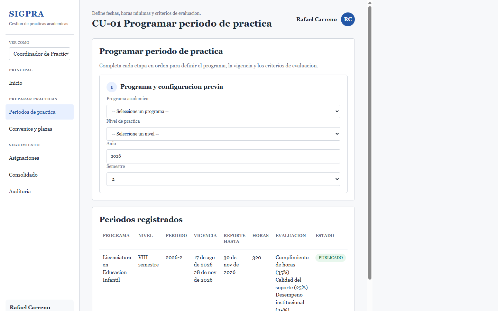
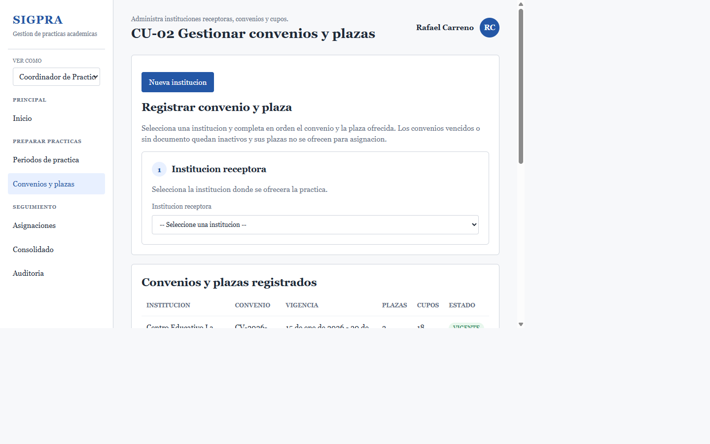
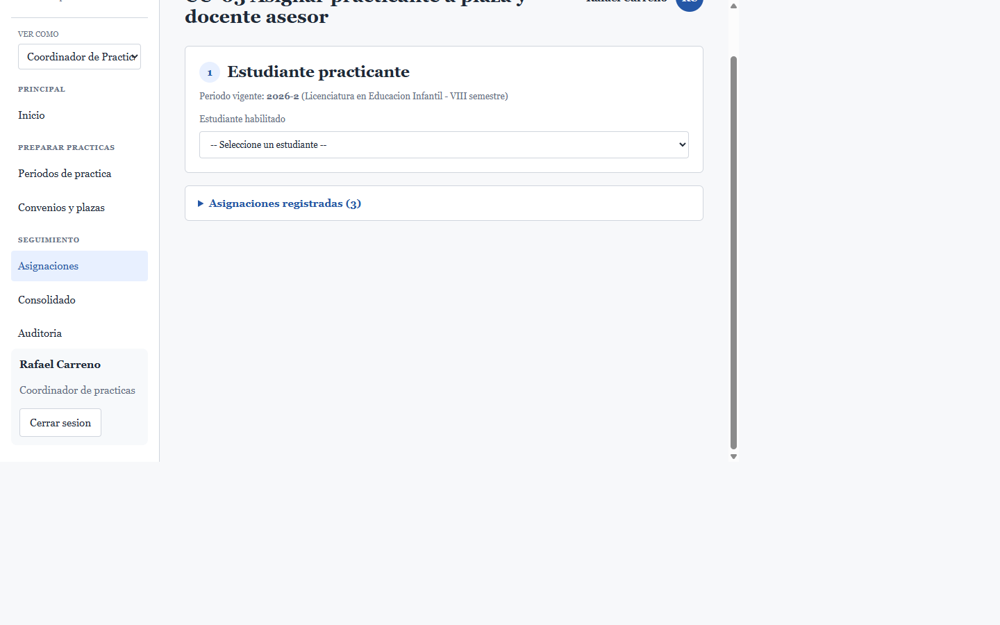
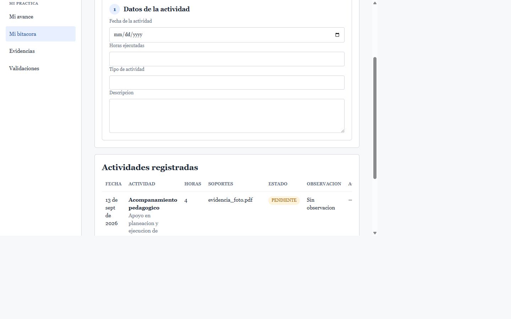
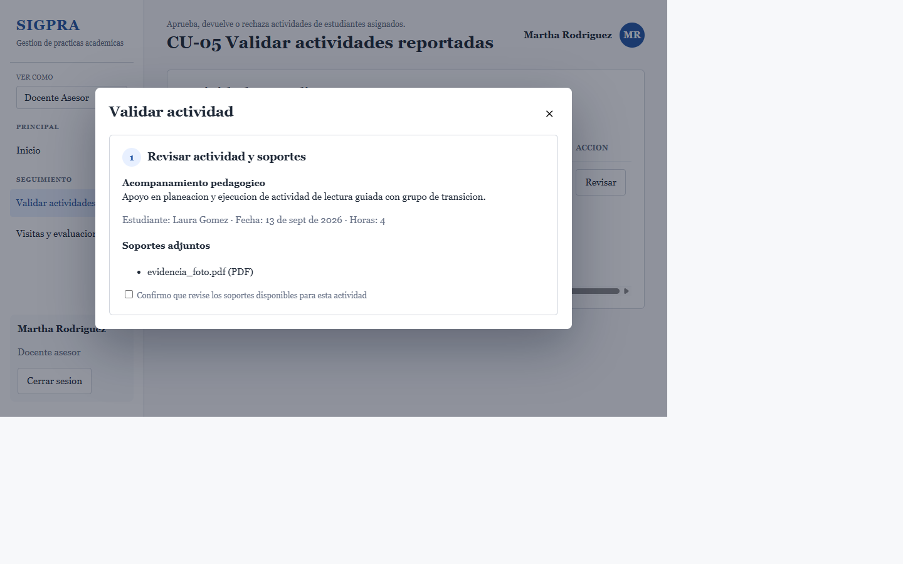
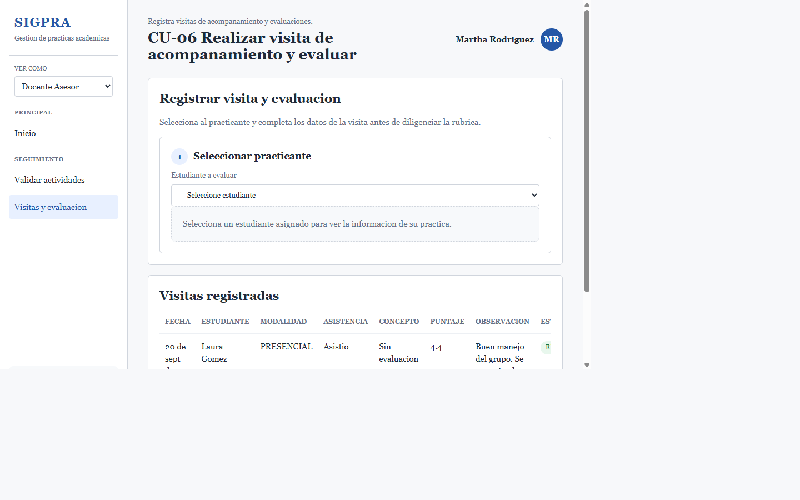
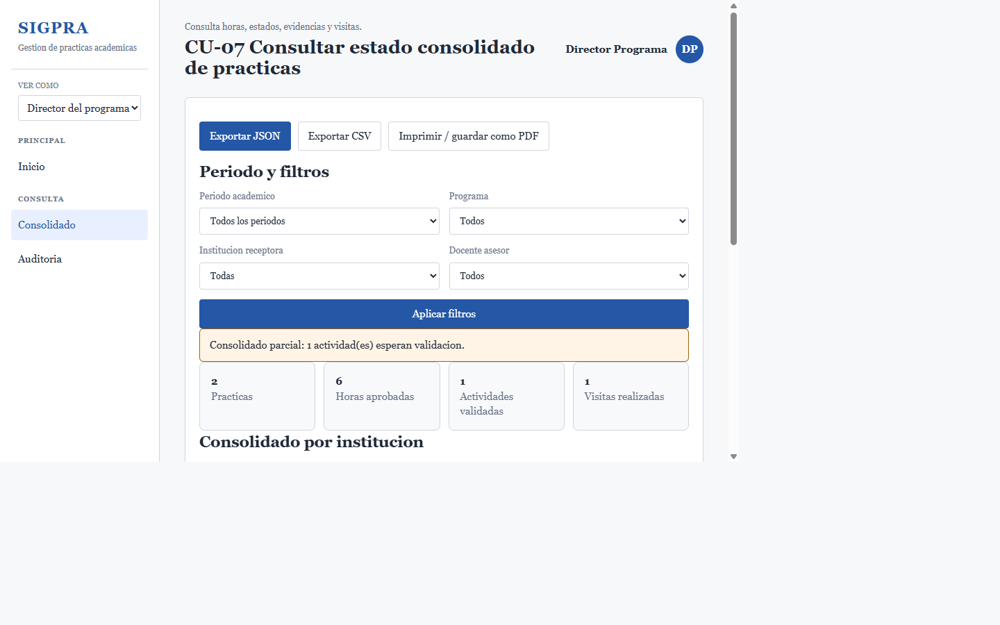

# Prototipos de mediana fidelidad - SIGPRA

Este archivo documenta el enlace de acceso a los prototipos de mediana fidelidad elaborados en Figma para la aplicacion web SIGPRA.

## Enlace al prototipo

[Abrir prototipos SIGPRA en Figma](https://www.figma.com/design/RZYp1EuRTjzHCWiIUrWzGB/SIGPRA---Prototipos-mediana-fidelidad)

## Contenido del prototipo

El archivo de Figma contiene las siguientes paginas:

- Vista general del prototipo.
- Flujo general.
- CU-01 Programar periodo de practica.
- CU-02 Gestionar convenios y plazas.
- CU-03 Asignar practicante a plaza y docente asesor.
- CU-04 Registrar actividad ejecutada y soportes.
- CU-05 Validar actividades reportadas.
- CU-06 Realizar visita de acompanamiento y evaluar.
- CU-07 Consultar estado consolidado de practicas.
- [Vistas actuales SIGPRA](#vistas-actuales-sigpra): pagina agregada el 4 de octubre de 2026 con las pantallas actuales de la aplicacion para CU-01 a CU-07.

## Vistas actuales SIGPRA

La pagina **Vistas actuales SIGPRA**, agregada hoy al archivo de Figma, reune en una cuadricula las capturas de las siete vistas actuales de la aplicacion. Las imagenes originales tambien se conservan en `Vistas_actuales_SIGPRA/` dentro de esta entrega.

### CU-01 - Programar periodo de practica

### CU-02 - Gestionar convenios y plazas

### CU-03 - Asignar practicante a plaza y docente asesor

### CU-04 - Registrar actividad ejecutada y soportes

### CU-05 - Validar actividades reportadas

### CU-06 - Realizar visita de acompanamiento y evaluar

### CU-07 - Consultar estado consolidado de practicas

Las imagenes son capturas estaticas de la aplicacion, no un prototipo interactivo. Los prototipos originales de Figma se conservan en sus paginas independientes.

## Nota para revision

El prototipo representa pantallas de mediana fidelidad de una aplicacion web administrativa. Cada pantalla corresponde a un caso de uso definido en la propuesta del proyecto y muestra estructura, navegacion, formularios, tablas, estados y acciones principales.
